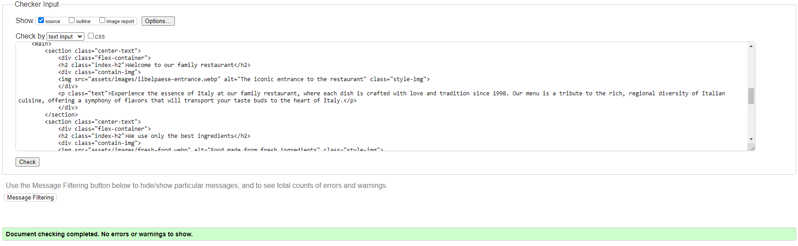
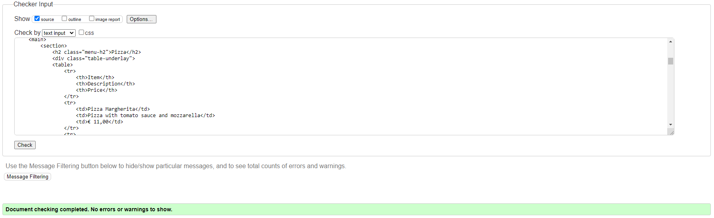
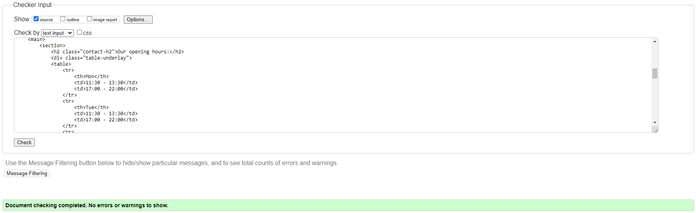
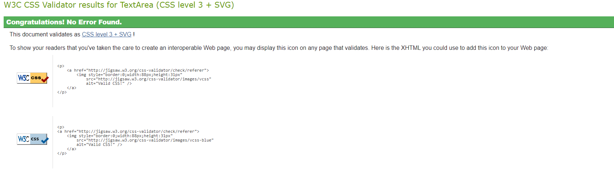
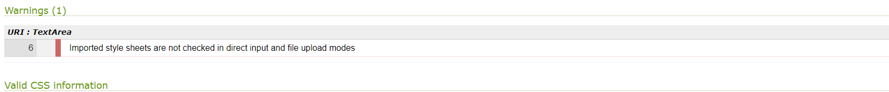
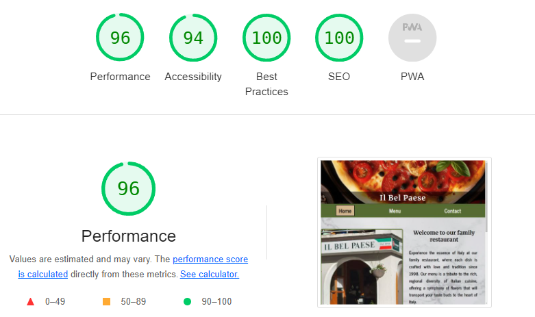
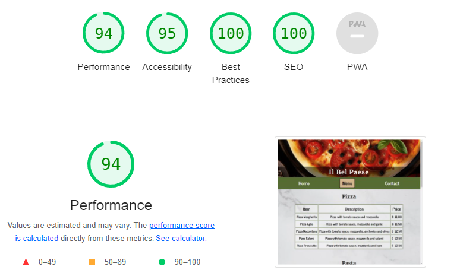
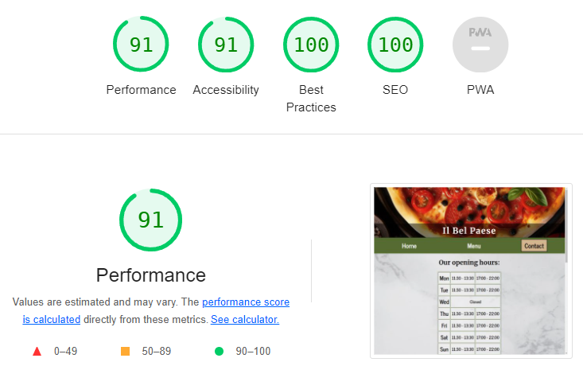

# Il Bel Paese

A website here to provide information about an italian restaurant based in Austria, Schruns.

The central location of the restaurant makes it an ideal destination for tourist but also for the locals alike. The restaurant is being loved by customers since its opening in 1998, due to the tasty italian meals made with authenticity and love.

Deployed link to the website: https://tekali7.github.io/IlBelPaese/

(AM I RESPONSIVE SCREENSHOT)

# Purpose of this project

This project will have real word value in the near future as it will be used to attract and inform customers. This website will be used when the future developer has learned and implemented the necessary course material.

# Table of contents:

* User Demographic

* User Experience
    * User stories
        * First Time Visitor Goals
        * Returning Visitor Goals
        * Frequent User Goals

* Features
    * Hero
    * Navigation
    * Homepage
    * Menu
    * Contact
    * Form
    * Footer
    * Future implementations

* Technology
    * Languages
    * Frameworks, Libraries and Programs

* Typography and color scheme

* Testing
    * Validator Testing
        * W3C HTML Validator
        * W3C CSS Validator
    * Lighthouse Testing
    * Manual Testing
    * Device Testing
    * Browser Compatibility
    * Fixed Bugs

* Deployment
    * How to Deploy
    * How to Fork
    * How to Clone

* Content
    * Text
    * Media

* Credit

# User Demographic

The main target audience are the frequent tourists from all over the world that visit the area.  

Also local customers which already know the long-standing restaurant.

The website targets a wide age range, from families with children looking for a welcoming atmosphere to couples seeking a romantic dinner setting.

# User Experience
## User stories

### A. First time visitor goals

- As a first time visitor, I want to easily understand the main purpose of the website and learn more about the organisation.

- As a first time visitor, I want to be able to easily navigate throughout the website to find content.

- As a first time visitor, I want to be able to easily navigate to and view a menu of meals and drinks.

### B. Returning visitor goals

- As a returning visitor, I want to be able to access and view the menu quickly and easily.

- As a returning visitor, I want to be able to check opening hours quickly and easily.

- As a returning visitor, I want to be able to contact the organisation to give feedback or ask questions.

### C. Frequent user goals

- As a frequent user, I want to be able to check new meals and drinks the business offers.

- As a frequent user, I want to be able to contact the organisation to give feedback, ask questions or follow-up on existing communications.

# Features

The website consists of three pages with numerous features which offer the user a pleasant website experience.

## Hero

The hero image showcases a pizza so that the user instantly knows what the theme of the website is about. The image is responsive and therefore changes its size on different screen sizes.

## Navigation

The navigation bar offers a quick and easy way to reach the three pages of the website, it can be found on the upper part of every page. It also shows which page the user is currently on through the buttons of the navigation bar. The selected page button will distinguish itself from the other two buttons through colors and a box around it.

## Homepage

The "Home" page informs the user about the restaurant to keep them on the website and to make the future customer take more interest in what the restaurant offers. This is achieved by describing the restaurants history, the menu and also the habit of only using fresh ingredients. These descriptions are decorated with images to further grow the interest of the customer.

## Menu

The "Menu" page presents a clean overview of what the restaurant offers. The page consists of four tables with various meals and drinks, imitating a handheld menu from the restaurant. The tables have a white underlay with a low opacity to provide more contrast and therefore give the user better readability of the tables contents.

## Contact

The "Contact" page informs the user of the opening hours of the restaurant. The hours are presented with a table, showing the opening hours for each day of the week in a horizontal line. This table also has a white underlay with low opacity to provide more contrast for the user.

## Form

The form is a feature in the "Contact" page. It gives the website user an opportunity to give the restaurant feedback, ask a question or to request something. The form consists of three input areas for the name of the user, the E-Mail Address and their message. The E-Mail Address allows the restaurant to thank the user for their feedback or to answer their questions. The message input area is slightly larger than the other input areas as this allows the user to see more of their text while writing.

## Footer

The footer consists of a heading, informing the user of the existing social medias of the restaurant. Under the heading are three icons with the according links. Two of these icons take the user to the restaurants real facebook or instagram page. The icon with the phone gives the user the opportunity to call the restaurant without the user having to manually type the restaurants real phone number.

## Future implementations

Future implementations for this website are.

- A new page to give the user the opportunity to order online.

- A downloadable menu in PDF format in the "Menu" page.

- A feature to let users make an online reservation.

- Add content to inform users about the possibility to buy gift cards.

# Technology
## Languages

- HTML5
- CSS3

## Frameworks, Libraries and Programs

- IDE: [Visual Studio Code](<https://code.visualstudio.com/>)
- Repository: [GitHub](<https://github.com/Tekali7/IlBelPaese>)
- Image converter: [Convertio](<https://convertio.co/de/jpg-webp/>)
- Image compression: [Tinypng](<https://tinypng.com/>)
- Favicon generator: [Favicon](<https://favicon.io/>)
- Wireframe: [Balsamiq](<https://balsamiq.com/>)
- Fonts: [Google Fonts](<https://fonts.google.com/>)

# Typography and color scheme

The typography was chosen because it gives the user a calm and pleasant reading experience with rounded and clean letters.  
The fonts Merriweather and News Cycle from [Google fonts](<https://fonts.google.com/>) have been applied to this website.

The color scheme was chosen to represent italys flag colors, except for the red in it. The green from the navigation bar and the footer reminds the user of the countrys beautiful landscape and the earthy tan color in the selected-page button and the [fontawesome](<https://fontawesome.com/>) icons compliment this further. The white marble background reminds the user of italys history and gives the website a noble touch.

# Testing
## Validator Testing

The validation results are displayed with a snippet of the code to indicate their association with the respective page.

### [HTML Validator](<https://validator.w3.org/#validate_by_uri>)

- Validator result for index.html

- Validator result for menu.html

- Validator result for contact.html

### [CSS Validator](<https://jigsaw.w3.org/css-validator/>)

- Validator result for style.css

- Validator warning

This warning is due to the import of the Google fonts.

## Lighthouse Testing

The website was tested using Lighthouse in Chrome DevTools throughout the development to check performance, accessibiltiy, best practices and SEO. The final test on Lighthouse was run on incognito mode.

- Lighthouse result for index.html

- Lighthouse result for menu.html

- Lighthouse result for contact.html

## Manual Testing

## Device Testing

## Browser Compatibility

- Testing has been carried out on the following browsers:
    - Chrome Version 118.0.5993.117/118
    - Safari Version 17.1
    - Edge Version 118.0.2088.76
    - Firefox Version 119.0

## Fixed Bugs

# Deployment
## How to Deploy

Website deployment is the process of making a website live and accessible on the internet for people to visit.

1. Log into GitHub.
2. Locate repository (left-side or top-right icon and then on "Your repositories").
3. Select repository and navigate to "Settings" on the horizontal bar.
4. Open the "Pages" menu and select "main" for the branch.
5. The page will refresh with a link to the deployed website.
6. It may not go live for a few minutes, refresh the page to update the link.
7. Once deployed, the live website will automatically update when any changes are pushed to the main branch.

## How to Fork

Forking allows you to create a copy of the original repository in your own GitHub account. This enables you to make changes to the code without affecting the original code.

1. Log into GitHub
2. Locate repository and select the repository.
3. Select the "Fork" button near the top-right.
4. You should now have a new copy of the original repository in your own GitHub account.

## How to Clone

Clowning allows you to make an exact copy of a code repository, usually for collaboration or to work on different features independently.

1. Log into GitHub
2. Locate repository and select the repository.
3. Click the green "<> Code" button.
4. If you want to clone using HTTPS, select the copy button in the HTTPS menu.
5. Open Git Bash
6. Change the current working directory to the location where you want your cloned directory to be.
7. Type "git clone", and then paste the URL you copied earlier and press "Enter".